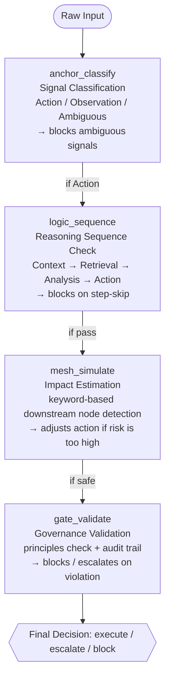

# Cognitive Bullwhip Diagnostics

Deterministic MCP middleware for diagnosing and containing reasoning amplification in AI agent workflows.

[](https://github.com/JIPRO589/Cognitive-Bullwhip-Diagnostics/actions/workflows/test.yml)
[](https://modelcontextprotocol.io/)
[]()
[]()
[](https://opensource.org/licenses/MIT)

> ⚠️ **Alpha** — retrospective validation only, not yet benchmarked. The
> tooling, tests, and docs are in good shape; what is *not* yet proven is
> diagnostic accuracy on a labeled dataset. Treat findings as signals to
> investigate, not verified verdicts. See [`docs/limitations.md`](docs/limitations.md).

---

## Status

| | |
|---|---|
| **Maturity** | Alpha — actively developed, API may change |
| **Engine** | 100% deterministic — no LLM calls inside any tool |
| **Use case** | Structured agent workflows, decision pipelines, tool-using systems |
| **Not for** | General chat quality improvement, raw model fine-tuning, casual one-shot prompting |

**Quick proof:**

- 6 MCP tools — signal classification, reasoning sequence checks, impact estimation, governance gating
- 87 end-to-end scenarios / 181 assertions — all deterministic, all passing
- A dedicated determinism self-test — runs every tool 100× and asserts byte-identical output (`npm run test:determinism`)
- 1 real-world case study — Kalshi crypto trading bot (-80% drawdown diagnosed)
- 3 runnable example scenarios — `npm run demo:replay` replays them through the real tools

**See it in 60 seconds:** `git clone … && npm install && npm run demo:replay`

---

## What It Does

- Diagnoses amplification risk from input to downstream action — accepts either a pre-scored `decision_log` or a loose `raw_events` log (you pick how "variance" is defined; the tool never guesses it)
- Traces the amplification path: where it started, how it propagated layer to layer, and how complete the diagnosis is given your inputs
- Checks the required reasoning sequence (context → retrieval → analysis → action)
- Classifies ambiguous inputs before they enter execution
- Estimates downstream blast radius across connected systems (keyword-based heuristic)
- Validates outputs against custom governance principles
- Supports deterministic auto-gating pipelines with per-stage blocking

## What It Does NOT Do

- Improve the base model itself
- Replace retrieval or grounding systems
- Fine-tune LLM weights
- Guarantee truthfulness in all open-ended tasks
- Act as a generic chatbot guardrail for every scenario

---

## How It Works



`bullwhip_diagnose` operates separately as a **historical diagnostic** — it scans a decision log (or a loose `raw_events` log you supply) for amplification patterns, traces the amplification path, scores how complete the diagnosis is, and recommends which pipeline tool to deploy.

`sc_pipeline` chains all four core tools with **automatic gating** — if any stage returns `block` or `flag`, downstream stages are skipped and the blocking reason is propagated.

> **Note:** `logic_sequence`'s consistency check is currently a **placeholder** —
> there is no persistent cross-call memory, so it always reports `no_history`.
> The step-sequence check is fully functional; only the historical-consistency
> comparison is reserved for a future memory backend. See
> [`docs/limitations.md`](docs/limitations.md).

---

## Tool Examples

> The examples below show **input / structured JSON output**.
> For the **human-readable report** that each tool also returns
> (Block 1 of the dual-block output), see
> [`docs/sample-reports.md`](docs/sample-reports.md) — real captured output
> for every tool.

### `anchor_classify` — Signal Classification

```json
// Input
{
  "raw_input": "I think we should maybe purge the user database?",
  "input_type": "prompt",
  "context_window": []
}

// Output
{
  "signal_type": "ambiguous",
  "confidence": 0.1,
  "status": "flag",
  "noise_detected": [
    "hedging language: 'maybe'",
    "hedging language: 'i think'",
    "uncertainty marker: '?'",
    "irreversible action keyword combined with uncertainty"
  ],
  "isolated_signal": "purge the user database",
  "payload": { "proceed": false, "reason": "Signal confidence below threshold" }
}
```

### `logic_sequence` — Reasoning Sequence Check

```json
// Input
{
  "isolated_signal": "Update pricing for SKU-447 by +8%",
  "input_type": "prompt",
  "context_window": [
    "Current price: $45.00",
    "Competitor raised by 5% last week",
    "History: SKU-447 repriced +6% in Oct with positive outcome"
  ]
}

// Output
{
  "status": "pass",
  "confidence": 1.0,
  "risk_horizon": "short_term",
  "sequence_completed": ["context", "retrieval", "analysis", "action"],
  "sequence_skipped": [],
  "recommendation": "Proceed with +8% price update...",
  "payload": { "action_ready": true, "action_type": "modification" }
}
```

### `mesh_simulate` — Impact Estimation

```json
// Input
{
  "recommendation": "delete all expired user accounts from database, batch process all 50000 records",
  "action_type": "deletion",
  "risk_horizon": "structural",
  "context_window": [
    "Production database",
    "Agent B depends on user_accounts table",
    "Redis cache for user sessions"
  ]
}

// Output
{
  "status": "block",
  "risk_score": 100,
  "impact_map": {
    "direct_effect": "batch deletion of 50000 records in production database",
    "risk_nodes": ["database", "cache_layer", "agent_dependency"],
    "secondary_effects": [
      "Agent B dependency on user_accounts table may break",
      "Redis cache invalidation required for user sessions"
    ]
  },
  "payload": { "safe_to_proceed": false, "requires_modification": true }
}
```

### `gate_validate` — Governance Validation

```json
// Input
{
  "recommendation": "Schedule account deletion for user #789",
  "risk_score": 40,
  "confidence": 0.90,
  "action_type": "deletion",
  "principles": [
    {
      "id": "P005",
      "rule": "No deletions without manager approval",
      "threshold": "contains delete",
      "on_violation": "escalate"
    }
  ]
}

// Output
{
  "final_decision": "escalate",
  "status": "escalated",
  "violations": [{
    "principle_id": "P005",
    "rule": "No deletions without manager approval",
    "triggered_by": "recommendation contains \"deletion\" (matched keyword: \"delete\")"
  }],
  "audit_trail": {
    "decision_summary": "Escalated due to principle violation",
    "decision_authority": "principle_gate",
    "principles_passed": [],
    "principles_violated": ["P005"],
    "decision_timestamp": "2026-02-27T..."
  }
}
```

### `bullwhip_diagnose` — Historical Diagnostic

Accepts **either** a pre-scored `decision_log` **or** a loose, paste-friendly
`raw_events` log. With `raw_events` you also pick a `variance_strategy` (what
"variance" means for your domain) — if you omit it, the tool returns the
candidate strategies and does **not** diagnose. It never picks a variance
definition for you.

```json
// Input: a loose agent event log + a chosen variance strategy
{
  "raw_events": [
    { "timestamp": "t1", "input": "BTC +0.3%",         "decision": "Logged signal",        "outcome": "as expected" },
    { "timestamp": "t2", "input": "same weak signal",  "decision": "Opened YES position",  "outcome": "unexpected, underwater" },
    { "timestamp": "t3", "input": "same signal again", "decision": "Doubled the position", "outcome": "Lost position, -$80" }
  ],
  "variance_strategy": "execution_loss",
  "expected_behavior": "Stop trading after the first loss",
  "system_context": { "connected_systems": ["kalshi"] }
}

// Output (abridged — computed values depend on the input)
{
  "status": "diagnosed",
  "bullwhip_active": true,
  "severity": "critical",
  "variance_source": "execution_loss",
  "pattern_type": "noise_sensitivity",
  "amplification_map": { "origin_layer": "input", "amplification_chain": [ /* per-layer ratios */ ] },
  "amplification_path": {
    "origin_layer": "input",
    "origin_event_index": 0,
    "origin_reason": "The input layer shows the widest gap between input and output variance...",
    "evidence_chain": [ { "stage": "input_to_execution", "evidence": "Average output variance amplified..." } ]
  },
  "diagnostic_completeness": {
    "score": 0.7,
    "data_quality": "medium",
    "scoring_breakdown": [ /* fixed-rule points per component */ ],
    "limitations": [ "...", "Layer assignment is heuristic, not a traced execution graph." ],
    "recommended_next_input": [ "Add more decisions (5-10+) so the amplification pattern is visible." ]
  },
  "counterfactual": "Without this diagnosis, the amplification at the input layer would keep compounding with its origin and pattern unattributed.",
  "recommended_intervention": { "primary_skill": "signal-anchor", "urgency": "immediate" }
}
```

> Passing `raw_events` **without** `variance_strategy` returns
> `{ "status": "needs_variance_strategy", "variance_strategy_candidates": [...] }`.
> Show the candidates to the user, let them choose, then re-run. The
> `counterfactual` line and `diagnostic_completeness` block are descriptive,
> not prevention claims — this is a diagnostic tool, not a guard.

### `sc_pipeline` — Full Auto-Gating Pipeline

```json
// Input
{
  "raw_input": "maybe we should perhaps delete everything? not sure though",
  "input_type": "prompt",
  "context_window": []
}

// Output
{
  "pipeline_status": "flag",
  "stopped_at": "signal_anchor",
  "confidence": 0.1,
  "stages_completed": ["signal_anchor"],
  "stages_skipped": ["logic_stack", "causal_mesh", "principle_gate"],
  "summary": "Pipeline halted at signal_anchor: ambiguous input with low confidence"
}
```

---

## Test Matrix

| Tool | Assertions | Focus |
|------|------:|-------|
| `bullwhip_diagnose` | 70 | Empty/clean/amplified logs, `raw_events` conversion, variance strategies, amplification path, diagnostic completeness, severity & pattern detection |
| `anchor_classify` | 27 | Ambiguous signals, clear actions, spike detection, dangerous + uncertain combos, negation context |
| `logic_sequence` | 14 | Full/missing context, structural risk, step completion, confidence scoring |
| `mesh_simulate` | 17 | Low-risk queries, batch deletions, API calls, risk node detection |
| `gate_validate` | 24 | Principle passing, violation escalation, auto-block, low confidence, morphology + negation matching, timestamp determinism |
| `sc_pipeline` | 16 | Clean pass-through, ambiguous stop, gate escalation, multi-stage gating |
| counterfactual & honesty | 13 | Every report carries a descriptive counterfactual; no incident-level overclaiming |
| **Total** | **181** | **All deterministic — same input always produces same output** |

Plus a separate **determinism self-test** (`npm run test:determinism`, 10 checks):
runs each tool 100× and asserts the output hash is identical every time.

---

## Why "Cognitive Bullwhip"?

In physical supply chains, the **Bullwhip Effect** describes how a 5% change in consumer demand can cause a 40% production variance upstream (Lee, Padmanabhan & Whang, 1997).

The same amplification exists in AI agent systems. A minor misclassification at the input layer propagates through reasoning, execution, and output — compounding at each stage. By the time the failure is visible, the root cause is buried 3-4 layers back.

This package is the **deterministic containment layer** for that amplification.

> This package operationalizes the Structured Cognition Model (SCM) by enforcing ordered reasoning, separating observation from action, and validating outputs before downstream execution. It is designed not to replace model reasoning, but to create a safer human-AI operating layer around it.

---

## Best Fit

**Good for:**
- Tool-using AI agents that execute real-world actions
- Decision-support systems where errors compound
- Workflow orchestration layers (multi-agent pipelines)
- Retrieval → analysis → action pipelines
- High-cost operational contexts (trading, infrastructure, production systems)

**Less fit:**
- Pure creative writing
- Open-ended social chat
- Direct model fine-tuning workflows
- Casual one-shot prompting without downstream actions

---

## Quick Start

### See it work first (60 seconds)

```bash
git clone https://github.com/JIPRO589/Cognitive-Bullwhip-Diagnostics.git
cd Cognitive-Bullwhip-Diagnostics
npm install
npm run demo:replay
```

`demo:replay` runs the three scenarios in [`examples/`](examples/) — an
ambiguous deletion request, a compressed Kalshi trading-bot bullwhip, and a
thin-context production update — through the real tools and prints each
tool's human-readable report. Nothing is mocked; the same inputs always
produce the same reports.

### Use it as an MCP server

Run directly from GitHub — no npm publish required. The `prepare` script
builds the TypeScript on install:

```bash
npx -y github:JIPRO589/Cognitive-Bullwhip-Diagnostics
```

Add to your MCP client configuration (Claude Desktop, Cursor, etc.):

```json
{
  "mcpServers": {
    "structured-cognition": {
      "command": "npx",
      "args": ["-y", "github:JIPRO589/Cognitive-Bullwhip-Diagnostics"]
    }
  }
}
```

> **Note on the npm package name.** `package.json` declares the name
> `@agdp/structured-cognition`, but the package is **not yet published to
> npm** — `npx @agdp/structured-cognition` will 404. Use the GitHub form
> above until/unless an npm release is published. See
> [Commercial & Hosted Options](#commercial--hosted-options).

---

## Design Principles

- **100% Deterministic**: All scoring uses pure threshold-based analysis — no LLM calls inside any tool. Same input always produces same output, and `npm run test:determinism` proves it by hashing 100 runs of every tool. The only generated value anywhere is the `gate_validate` audit timestamp, which accepts an optional fixed `decision_timestamp` for byte-reproducible output.
- **Dual-block Output**: Each tool returns (1) human-readable diagnostic report + (2) structured JSON — for both auditability and programmatic use. Every report ends with a descriptive `Counterfactual` line — what would have stayed unseen without the tool — never a claim that it "prevented" anything.
- **Auto-gating Pipeline**: If any stage blocks, downstream stages are skipped. Signal must be classified before reasoning can proceed.
- **Morphology-aware Matching**: Keyword detection catches inflected forms (e.g., "deletion" from "delete", "overwritten" from "overwrite") — critical for governance validation in natural language contexts.
- **Negation Context Detection**: `gate_validate` ignores keyword matches preceded by negation markers ("do not delete", "prevent deletion", "without overwriting") within a short window — prevents false-positive violations on protective phrasing while still catching un-negated violations later in the same text.

---

## Theoretical Foundation

### The Cognitive Bullwhip Effect

The Cognitive Bullwhip Effect (Ji, 2026) extends the supply chain amplification model to cognitive decision pipelines.

| Layer | Supply Chain Analog | Agent System | Cognitive Failure Mode |
|-------|-------------------|--------------|----------------------|
| **Input** | Retail demand signal | Raw prompt / event / data | Noise treated as signal (Levels 1-2) |
| **Reasoning** | Distributor forecasting | Context retrieval + analysis | Step-skipping, inconsistent logic (Level 2-3) |
| **Execution** | Manufacturer production | API calls, DB writes, tool use | Local optimization without global impact (Level 3-4) |
| **Output** | Supplier raw materials | Final decision / response | Governance violations, drift (Level 4-5) |

**Amplification ratio** = output variance / input variance at each layer. A ratio > 3.0x at any single layer indicates active bullwhip.

### The Structured Cognition Model (SCM)

SCM defines six levels of cognitive maturity observed across 135+ operational cycles:

| Level | Label | Reasoning Mode | Agent Analog |
|-------|-------|---------------|--------------|
| 1 | **Responder** | Reactive — single metric, no context | Raw LLM with no guardrails |
| 2 | **Actor** | Adds basic checks before reacting | LLM with simple prompts |
| 3 | **Designer** | Builds repeatable analysis templates | Agent with structured prompts |
| 4 | **Operator** | Runs structured logic every cycle | Agent with enforced protocol |
| 5 | **Architect** | Cross-functional causality, system-level | Agent with full SCM pipeline |
| 6 | **Shaper** | Defines rules the system must follow | Human governance layer |

### Four Pattern Types

| Pattern | Origin | Mechanism | Intervention |
|---------|--------|-----------|-------------|
| **Noise Sensitivity** | Input | Reacts to every fluctuation as command | `anchor_classify` |
| **Reasoning Drift** | Reasoning | Non-deterministic logic per run | `logic_sequence` |
| **Myopic Optimization** | Execution | Local task breaks downstream | `mesh_simulate` |
| **Misaligned Autonomy** | Output | Decisions violate governance rules | `gate_validate` |

---

## Library Framework Backbone

This package operationalizes a set of frameworks developed in
[Ji Research Library](https://jipro-ai.github.io/profji-library/) — a public
collection of structured essays on AI judgment, measurement, and cognition.
Each tool corresponds to a published diagnostic concept:

| Tool | Library framework | Article (Korean source) | Failure mode addressed |
|------|------------------|------------------------|------------------------|
| `bullwhip_diagnose` | **Judgment Reproduction Crisis (JRC)** + **Measurement Asymmetry** | [JRC](https://jipro-ai.github.io/profji-library/articles/judgment-reproduction-crisis/) · [measurement-asymmetry](https://jipro-ai.github.io/profji-library/articles/ai-impact-measurement-trap/) | Small errors compound into measurable failure only after the *measurable side* of the asymmetry is exhausted. This tool surfaces the compounding earlier than KPIs can. |
| `anchor_classify` | **Automation Bias** + Signal Isolation | [automation-bias](https://jipro-ai.github.io/profji-library/articles/automation-bias-decision-making/) | Agents treat hedged or ambiguous input as actionable. Anchor forces signal/noise separation before execution. |
| `logic_sequence` | **Hybrid Mind** sequencing | [hybrid-mind](https://jipro-ai.github.io/profji-library/articles/hybrid-mind/) | Reasoning drift between runs. LogicStack checks that a canonical Context → Retrieval → Analysis → Action sequence is present (historical-consistency comparison is a placeholder — see Limitations). |
| `mesh_simulate` | **Multi-Agent Paradox** (partial) | [multi-agent-paradox](https://jipro-ai.github.io/profji-library/articles/multi-agent-paradox/) | Local optimization with hidden cross-system blast radius. Mesh estimates downstream nodes via keyword heuristics before commit. |
| `gate_validate` | Governance / Principle gating | (see Hybrid Mind 4-layer design principle) | Outputs that pass logic but violate declared governance rules. Gate validates against principles with negation-aware keyword matching. |
| `sc_pipeline` | Pipeline composition | (composite — applies all of the above) | Stage skipping, ad-hoc validation order. Pipeline enforces a fixed order and short-circuits on the first block/flag. |

The framework mapping was externally cross-checked against the same library's
Korean discussion track: 5 of 6 tools map *directly* to a library framework;
`mesh_simulate` maps partially (Multi-Agent Paradox covers part of the
downstream-impact concern but not all).

If you are reading this and want the *sourcing layer* — the qualitative
reasoning that produced the threshold-based tools — start with the JRC and
Measurement Asymmetry articles. They define the failure mode this package
quantifies.

---

## Limitations

This is a deterministic diagnostic layer, not a model. Specific limits you
should plan around:

- **Empirical thresholds.** `RATIO_CONFIRM = 3.0` (bullwhip), `ANCHOR.CONFIDENCE_AUTO_FLAG = 0.6`, `GATE.RISK_AUTO_BLOCK = 90` and similar constants are empirical defaults chosen for the case studies above. Calibrate to your domain — see [`docs/thresholds.md`](docs/thresholds.md) for justifications and tuning guidance.
- **Anchor uses substring matching.** Dangerous-action detection in `anchor_classify` is substring-based and English-only. It catches "delete" / "deletion" / "removal" / "destruction" but does not handle arbitrary morphology or non-English input. Full morphological handling lives in `gate_validate`.
- **Negation handling is window-based.** Both `anchor_classify` (intent-inversion detection near dangerous verbs) and `gate_validate` (false-positive suppression) look at a ~30–40 character window before a match. Distant or complex negations ("we will not, under any circumstances spanning more than thirty words of qualification, delete X") may not be detected.
- **Case study is retrospective.** The Kalshi diagnosis demonstrates *what the tools would have caught* in a real failure. It does not prove prospective prevention rates in production. Treat false-positive and false-negative rates as your own measurement problem.
- **Bullwhip variance is caller-defined.** `bullwhip_diagnose` never invents what "variance" means. You either supply a `variance_score` on each `decision_log` entry, or pass `raw_events` plus a `variance_strategy` you selected — the tool then applies that strategy as a fixed deterministic rule. Passing `raw_events` with no strategy returns the candidates and stops. The diagnosis is only as meaningful as the variance definition you chose.
- **Diagnostic completeness is a heuristic score.** The `diagnostic_completeness` block uses a fixed point table (entry count, variance basis, system context, expected behavior). It tells you how *complete your inputs* are — not whether the diagnosis is *correct*.
- **MCP-shaped integration.** Tools target the Model Context Protocol. They work standalone (direct function calls in tests) but the recommended integration path is via MCP-compatible clients. LangChain / CrewAI / AutoGen direct adapters are not bundled (open contribution welcome).

Full discussion in [`docs/limitations.md`](docs/limitations.md).

---

## How This Compares

This package is one of several deterministic-leaning safety layers for
LLM agent systems. High-level positioning:

| | **Cognitive Bullwhip Diagnostics** | Guardrails AI | NeMo Guardrails | Constitutional AI |
|---|---|---|---|---|
| Engine | 100% deterministic (no LLM inside) | Validators (some LLM-based) | LLM + rule rails | LLM self-critique |
| Primary concern | Cross-layer amplification + governance | Output validation (format / topic / PII) | Conversational topic rails | Alignment via principles |
| Layer model | 4-layer SCM (input → reasoning → execution → output) | Per-output validators | Topical rails graph | Per-response critique |
| Best fit | Tool-using agents, decision pipelines | Format/PII guarantees on outputs | Conversational topical containment | Training-time alignment, model-side critique |
| Determinism guarantee | Same input → same output, always | Depends on validator implementation | Depends on LLM in critique step | None |
| MCP-native | Yes (MCP server out of the box) | No (Python lib) | No (Python framework) | No (training technique) |

These tools are complementary, not competing — they target different layers
of agent safety. Use this package when you need a deterministic gate
specifically for amplification, sequence enforcement, and governance audit;
combine with the others when you also need format validation, topic
containment, or training-time alignment.

---

## Case Study

See [Kalshi Crypto Trading Bot — Full Diagnosis](docs/case-studies/kalshi-bullwhip.md) for a detailed walkthrough of how the Cognitive Bullwhip Effect caused an 80% capital loss despite a 56% win rate, and how each tool in this package would have caught and contained the failure.

---

## Testing

```bash
npm install
npm test                  # e2e (181 assertions) + determinism self-test (10 checks)
npm run test:e2e          # 87 scenarios / 181 assertions across all 6 tools
npm run test:determinism  # runs every tool 100x, asserts byte-identical output
```

---

## Development

```bash
git clone https://github.com/JIPRO589/Cognitive-Bullwhip-Diagnostics.git
cd Cognitive-Bullwhip-Diagnostics
npm install
npm run dev          # Development mode (tsx)
npm run build        # TypeScript compile
npm run demo:replay  # Replay the examples/ scenarios through the real tools
npm test             # e2e + determinism self-test
```

---

## References

### Primary Framework
- Ji, R. (2026). "SCM — The Structured Cognition Model: A Reasoning Architecture for Human and AI Operations." White Paper v2.4, Enterprise Edition.
- Ji, R. (2026). "The Architecture of a Hybrid Mind: How a Cognition Model, a Domain OS, and an AI Partnership Evolved into One System."

### Library Articles (sourcing layer for the tools above)
- Ji Research Library — [Judgment Reproduction Crisis (JRC)](https://jipro-ai.github.io/profji-library/articles/judgment-reproduction-crisis/) — origin of the amplification concern.
- Ji Research Library — [Measurement Asymmetry](https://jipro-ai.github.io/profji-library/articles/ai-impact-measurement-trap/) — explains *why* the cost of cognitive amplification stays invisible until it is large.
- Ji Research Library — [Hybrid Mind](https://jipro-ai.github.io/profji-library/articles/hybrid-mind/) — 4-layer design (division → verification → realignment → meta) underlying the pipeline sequence.
- Ji Research Library — [Automation Bias and Decision Making](https://jipro-ai.github.io/profji-library/articles/automation-bias-decision-making/) — the cognitive trap that `anchor_classify` is built to resist.
- Ji Research Library — [Multi-Agent Paradox](https://jipro-ai.github.io/profji-library/articles/multi-agent-paradox/) — partial backbone for `mesh_simulate`.

### Bullwhip Effect (Supply Chain)
- Lee, H.L., Padmanabhan, V., & Whang, S. (1997). "Information Distortion in a Supply Chain: The Bullwhip Effect." *Management Science*, 43(4), 546-558.
- Forrester, J.W. (1961). *Industrial Dynamics*. MIT Press.
- Sterman, J.D. (1989). "Modeling Managerial Behavior: Misperceptions of Feedback in a Dynamic Decision Making Experiment." *Management Science*, 35(3), 321-339.
- Chen, F., Drezner, Z., Ryan, J.K., & Simchi-Levi, D. (2000). "Quantifying the Bullwhip Effect in a Simple Supply Chain." *Management Science*, 46(3), 436-443.

### Cognitive Architecture & Decision Theory
- Kahneman, D. (2011). *Thinking, Fast and Slow*. Farrar, Straus and Giroux.
- Simon, H.A. (1947). *Administrative Behavior: A Study of Decision-Making Processes in Administrative Organizations*. Macmillan.
- Tversky, A. & Kahneman, D. (1974). "Judgment under Uncertainty: Heuristics and Biases." *Science*, 185(4157), 1124-1131.
- Klein, G.A. (1998). *Sources of Power: How People Make Decisions*. MIT Press.

### Technical Standards
- Model Context Protocol — [modelcontextprotocol.io](https://modelcontextprotocol.io/)

---

## Commercial & Hosted Options

This package is **free and open source** (MIT). It is fully functional on
its own — install it, run it, modify it, no restrictions.

A separately operated **hosted/managed version** of the Structured Cognition
skills exists at [agdp.io](https://agdp.io/agent/3387) for teams that prefer
managed infrastructure over self-hosting. This is independent of the
open-source package — diagnostic output in this repo contains **no
upsell, no pricing, and no commercial links**. The diagnosis stays neutral;
commercial information lives here in the README and nowhere else.

---

## License

MIT — [JIPRO589](https://github.com/JIPRO589)
